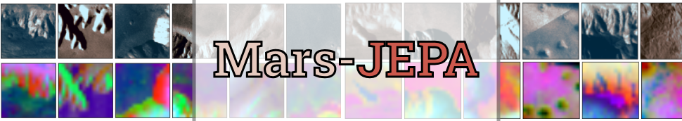
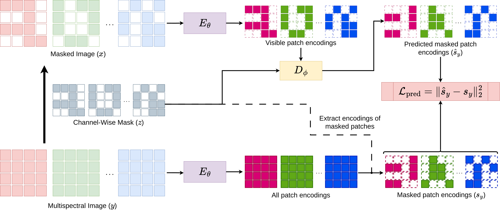

# Mars-JEPA: Multispectral Joint Embedding Predictive Architecture for Martian Landslide Segmentation



## :construction_worker: Authors

- Sattwik Sahu [[@sattwik-sahu](https://github.com/sattwik-sahu/)]
- Aditya Sinha [[@techaadii](https://github.com/techaadii)]
- Prof. Sujit P B [[@pbsujit](https://github.com/pbsujit)]

## :newspaper: News

- [2025-05-31] Mars-JEPA has been submitted to BMVC 2026

---

## Installation

### With `pip`

```bash
pip install git+https://github.com/sattwik-sahu/marsls-seg.git
```

### With `uv`

```bash
uv add git+https://github.com/sattwik-sahu/marsls-seg
```

### From Source

> [!NOTE]
> This installation mode requires [`uv` to be installed](https://docs.astral.sh/uv/getting-started/installation/), as the project dependencies are managed by `uv`.

```bash
git clone https://github.com/sattwik-sahu/marsls-seg.git
cd marsls-seg
uv sync --all-groups
```

## Setup

1. Download the MMLSv2 dataset from the instructions in [this repo](https://github.com/MAIN-Lab/MMLS_v2) and extract it
2. Get the normalization parameters file from [here](https://gist.github.com/sattwik-sahu/f1cc4d528be1df6226630e7a02fd842f)
3. Create a directory where you want the trained models' configs and weights to be stored as `$CKPT_DIR`

> We assume the dataset was extracted to `$DATA_ROOT` and the normalization parameters file was downloaded to `$PARAMS_FILE`.

## Usage

You can train SS-JEPA and the I-JEPA baselines from our code. This section explains how to get started with training.

### Training SS-JEPA

```bash
marsls-train model=ssjepa trainer=ssjepa \
  data.root_dir=$DATA_ROOT \
  data.params_file=$PARAMS_FILE \
  training.ckpt_dir=$CKPT_DIR
  model.encoder.dim=128 \
  training.batch_size=32 \
  training.lr=1e-4 \
  wandb.project="<your-wandb-project-name>" \
  wandb.group="<some-group-name>" \
  wandb.artifact_name="ssjepa-enc"
```

### Training I-JEPA

```bash
marsls-train model=ijepa trainer=ijepa \
  data.root_dir=$DATA_ROOT \
  data.params_file=$PARAMS_FILE \
  training.ckpt_dir=$CKPT_DIR
  model.encoder.dim=128 \
  training.batch_size=32 \
  training.lr=1e-4 \
  wandb.project="<your-wandb-project-name>" \
  wandb.group="<some-group-name>" \
  wandb.artifact_name="ijepa-enc"
```

### Segmentation Benchmarking

After training the self-supervised encoder backbones above, note down the paths of the final `.pt` file and `config.yaml` file created for the corresponding model in `$CKPT_DIR`. We refer to the above file paths as `$ENC_WEIGHTS` and `$ENC_CONFIG` here onwards.

To train and benchmark different segmentation models with the encoder backbones above, run

```bash
marsls-train -m model=segmentation trainer=segmentation \
  model/backbone=ssjepa \ # or ijepa
  model.backbone.jepa_ckpt_path=$ENC_WEIGHTS \
  model.backbone.jepa_config_path=$ENC_CONFIG \
  model.arch=fpn,unet,unetplusplus,deeplabv3 \ # add other archs as required
  data.root_dir=$DATA_ROOT \
  data.params_file=$PARAMS_FILE \
  training.ckpt_dir=$CKPT_DIR
  training.batch_size=32 \
  training.lr=1e-3 \
  wandb.project="<your-wandb-project-name>" \
  wandb.group="<some-group-name>" \
  wandb.run_name='${hydra:runtime.choices.model/backbone}-${model.arch}'
```

> [!NOTE]
> - The architectures used for `model.arch` above are from the [Segmentation Models Pytorch](https://smp.readthedocs.io/en/latest/index.html) package
> - If you run into CUDA OOM errors, try reducing the batch size
> - Extended configuration for more advanced options in the config will be released soon... :wink:

## Contributing

Feel free to raise an issue to ask for help setting up and running the project, or send a pull request to integrate new features you add to our repo.

---

Made with :heart: at IISER Bhopal
